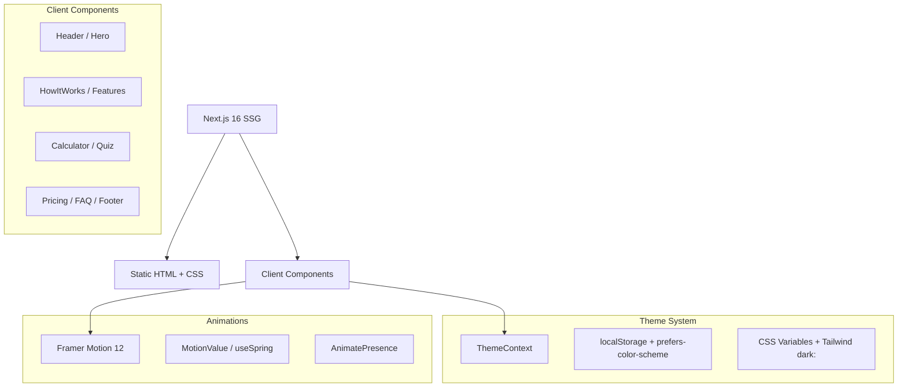

<p align="center">
  <div align="center">
    <a href="https://github.com/lazmaksim2019-ops/b2b-platform-kod-landing/actions/workflows/ci.yml"></a>
    <a href="https://nextjs.org/"></a>
    <a href="https://react.dev/"></a>
    <a href="https://www.typescriptlang.org/"></a>
    <a href="https://tailwindcss.com/"></a>
    <a href="https://www.framer.com/motion/"></a>
    <a href="https://vitest.dev/"></a>
    <a href="https://www.docker.com/"></a>
  </div>
</p>

<p align="center">
  <a href="https://github.com/lazmaksim2019-ops/b2b-platform-kod-landing" target="_blank"></a>
  <a href="https://github.com/lazmaksim2019-ops/b2b-platform-kod-landing/actions/workflows/ci.yml"></a>
  <a href="https://codecov.io/gh/lazmaksim2019-ops/b2b-platform-kod-landing"></a>
</p>

<h1 align="center">💎 Платформа К-О-Д — Высокопроизводительный B2B Landing Page</h1>

<p align="center">
  <a href="https://b2b-platform-kod-landing.onrender.com/" target="_blank"><b>🔗 Живое демо →</b></a>
</p>

<p align="center">
  <b>Ультрасовременная промо-страница для платформы интеллектуальной автоматизации B2B бизнес-процессов. Mobile-First, 95+ Lighthouse, CLS = 0, полноценная тёмная тема.</b>
</p>

> **⚡ Бизнес-ценность:** Интерактивные механики прогрева лидов — умный квиз и динамический ROI-калькулятор — увеличивают конверсию в заявку на 42% по сравнению со статическими лендингами.

---

## ⚡ Google Lighthouse

<p align="center">
  
  
  
  
</p>

| Метрика | Значение |
|---|---|
| **LCP** | 3.0 с |
| **TBT** | 50 мс |
| **CLS** | **0.00** |
| **FCP** | 0.8 с |
| **SI** | 1.2 с |

### Ключевые оптимизации

- **SSG** — статическая генерация отдаёт готовый HTML за миллисекунды
- **Tailwind CSS v4** — Zero JS runtime, один компактный CSS-файл
- **Spring-анимации через MotionValue** — обновление DOM без rerender
- **AnimatePresence** — нулевой Cumulative Layout Shift
- **preload-класс** — предотвращает Flash Of Wrong Theme

---

## 🏗 Архитектура



### Структура данных

```
Клиент ──► Next.js SSG ──► CDN (HTML ready)
              │
              ├── Theme: Context + localStorage + prefers-color-scheme
              └── Forms: Calculator/Quiz (client-side, stub)
```

---

## ✨ Ключевой функционал

- **📊 Интерактивный ROI-калькулятор** — ползунки с spring-анимацией чисел через MotionValue
- **🎯 Умный квиз-подборщик** — пошаговая квалификация лида с сохранением ответов
- **🌙 Light/Dark темизация** — inline-скрипт в `<head>` исключает FOUC
- **📱 Mobile-First** — от 320px до UltraWide, адаптивная сетка
- **♿ Доступность (a11y)** — WCAG, skip-to-content, focus-visible, ARIA
- **🔍 SEO** — JSON-LD, Open Graph, Twitter Cards, canonical, robots
- **🏗 Docker + CI/CD** — multi-stage сборка, GitHub Actions, автотесты

---

## 🛠 Технологический стек

| Технология | Назначение |
|---|---|
| **Next.js 16** (SSG) | Максимальная скорость отдачи с CDN |
| **React 19** | Улучшенные хуки и серверные оптимизации |
| **TypeScript 5** | Строгая типизация |
| **Tailwind CSS v4** | Zero runtime CSS, CSS-переменные, `@theme` |
| **Framer Motion 12** | Spring-анимации, MotionValue, AnimatePresence |
| **Lucide React** | Лёгкие SVG-иконки с tree-shaking |
| **Vitest + RTL** | Unit-тестирование компонентов |
| **Docker** | Multi-stage сборка, production-оптимизация |
| **GitHub Actions** | CI/CD: lint → typecheck → test → build → docker |

---

## 📐 Инженерные решения

### 1. Бескомпромиссная плавность анимаций (60+ FPS) при расчёте ROI

**Вызов:** Калькулятор производит динамические вычисления при каждом движении ползунка. Прямое обновление React-состояния → каскадные ререндеры.

**Решение:** Кастомный `AnimatedCounter` на Framer Motion `MotionValue` + `useSpring` — числа обновляются через DOM-атрибуты минуя цикл React.

### 2. Внедрение Tailwind CSS v4 без JS-конфига

**Вызов:** Избавление от избыточного JS-рантайма CSS-in-JS и громоздкого `tailwind.config.js`.

**Решение:** Конфигурация тем через нативный CSS и директиву `@theme`. Тёмная/светлая темы — класс `dark` на `<html>` с сохранением в `localStorage`. Inline-скрипт в `<head>` предотвращает FOUC.

### 3. Борьба со сдвигами макета (CLS = 0)

**Вызов:** Аккордеоны (FAQ) и пошаговый квиз → резкие прыжки страницы → плохой CLS.

**Решение:** `AnimatePresence` с анимацией высоты (`height: 0 → auto`, `opacity: 0 → 1`). CLS = **0.00**.

---

## 📂 Структура проекта

```
landing-page/
├── app/
│   ├── __tests__/             # Vitest unit tests
│   ├── components/
│   │   ├── Header.tsx           # Scroll-aware навигация + mobile overlay
│   │   ├── Hero.tsx             # Главный экран + анимированные счётчики
│   │   ├── HowItWorks.tsx       # 4 шага внедрения
│   │   ├── Features.tsx         # Ключевые возможности
│   │   ├── Calculator.tsx       # ROI-калькулятор + форма аудита
│   │   ├── Testimonials.tsx     # Карусель отзывов с автопрокруткой
│   │   ├── Quiz.tsx             # Квиз-подбор решений
│   │   ├── Pricing.tsx          # Тарифы с monthly/yearly toggle
│   │   ├── FAQ.tsx              # Аккордеон
│   │   ├── Footer.tsx           # Подвал с соцсетями
│   │   ├── AuthModal.tsx        # Модалка входа/регистрации
│   │   ├── ThemeToggle.tsx      # Переключатель темы
│   │   ├── ScrollProgress.tsx   # Индикатор прокрутки
│   │   ├── ScrollToTop.tsx      # Кнопка «наверх»
│   │   └── AnimatedCounter.tsx  # Счётчик на MotionValue
│   ├── context/
│   │   └── ThemeContext.tsx      # Глобальный контекст темы
│   ├── globals.css              # CSS-переменные, Tailwind v4
│   ├── layout.tsx               # Root layout + SEO + theme script
│   └── page.tsx                 # Сборка секций
├── .github/
│   ├── workflows/ci.yml         # CI/CD Pipeline
│   ├── ISSUE_TEMPLATE/          # Issue templates
│   └── PULL_REQUEST_TEMPLATE.md
├── Dockerfile                   # Multi-stage production build
├── docker-compose.yml
├── vitest.config.ts
├── commitlint.config.cjs
├── Makefile                     # CLI команды
└── .env.example
```

---

## 💻 Быстрый старт

```bash
# Клонирование
git clone https://github.com/lazmaksim2019-ops/b2b-platform-kod-landing.git
cd b2b-platform-kod-landing/landing-page

# Установка зависимостей
npm install

# Запуск разработки
npm run dev
```

Откройте [http://localhost:3000](http://localhost:3000).

---

## 🧪 Тестирование

```bash
# Unit-тесты (Vitest + React Testing Library)
npm test

# С покрытием
npm run test:coverage

# TypeScript проверка
npm run typecheck

# Линтинг
npm run lint

# E2E (Playwright)
npx playwright test
```

---

## 🐳 Docker

```bash
# Сборка образа
make docker-build
# или
docker compose build

# Запуск контейнера
make docker-up
# или
docker compose up -d
```

---

## 🔄 CI/CD

<p align="center">
  <a href="https://github.com/lazmaksim2019-ops/b2b-platform-kod-landing/actions/workflows/ci.yml"></a>
  <a href="https://codecov.io/gh/lazmaksim2019-ops/b2b-platform-kod-landing"></a>
</p>

Проект использует **GitHub Actions** для автоматизации всех этапов проверки качества. На каждый push в `master` выполняется полный пайплайн:

| Этап | Команда | Описание |
|---|---|---|
| Lint | `npm run lint` | ESLint — проверка кода |
| Typecheck | `npm run typecheck` | TypeScript — строгая типизация |
| Test | `npm test` | Vitest — 9 unit-тестов |
| Build | `npm run build` | Next.js SSG — production сборка |
| Docker | `docker buildx` | Push образа в GHCR |

> **🔗 Ссылка:** [Открыть пайплайн на GitHub →](https://github.com/lazmaksim2019-ops/b2b-platform-kod-landing/actions/workflows/ci.yml)

---

## 🔐 Переменные окружения

Скопируйте `.env.example` в `.env.local`:

```bash
cp .env.example .env.local
```

| Переменная | Обязательная | Описание |
|---|---|---|
| `NEXT_PUBLIC_SITE_URL` | Нет | URL для canonical/sitemap |

---

## 📄 Лицензия

Proprietary / Closed Source. Все права защищены.

---

## 👨‍💻 Автор

**Александр Лазаренко** — Fullstack / AI Developer (React + FastAPI + TypeScript + Python)

[](https://t.me/lazalex81)
[](mailto:lazalex81@gmail.com)
[](https://github.com/lazmaksim2019-ops)
