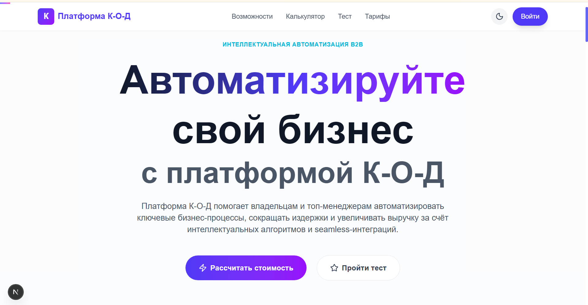
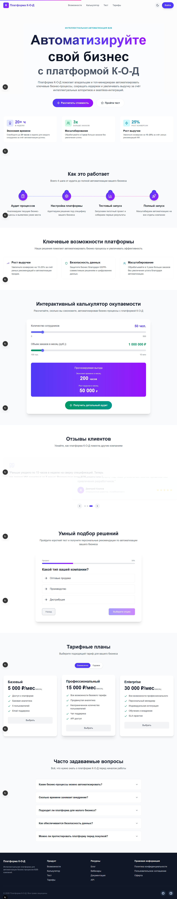

<p align="center">
  <div align="center">
    
    
    
    
    
    
  </div>
</p>

<br />

<h1 align="center">
  Платформа К-О-Д
  <br />
  <span>Интеллектуальная автоматизация B2B бизнес-процессов</span>
</h1>

<p align="center">
  <strong>Современная лендинг-страница</strong> для платформы автоматизации бизнес-процессов.
  <br />
  Разработана как <strong>портфолио-проект</strong>, демонстрирующий владение современным стеком веб-разработки.
</p>

<br />

<p align="center">
  
</p>

<br />

---

## ✨ Ключевые особенности

| # | Особенность | Описание |
|---|-------------|----------|
| 🎯 | **Интерактивный квиз** | Умный подбор решений с пошаговой формой и анимацией |
| 📊 | **Калькулятор окупаемости** | Динамический расчёт ROI с ползунками и анимированными счётчиками |
| 💎 | **Тарифные планы** | Гибкая система ценообразования с помесячной/годовой оплатой |
| 🌙 | **Тёмная/светлая тема** | Переключение с сохранением в localStorage |
| 🌀 | **Анимированные счётчики** | Плавная анимация чисел при скролле (Framer Motion spring) |
| 📋 | **FAQ с аккордеоном** | Анимированный список частых вопросов |
| 💬 | **Карусель отзывов** | Автопролистывающиеся отзывы клиентов |
| 📱 | **Полная адаптивность** | Mobile-first, корректно на всех устройствах |
| ♿ | **Accessibility** | ARIA-атрибуты, focus-стили, семантическая вёрстка |
| 🔍 | **SEO** | JSON-LD разметка, Open Graph, Twitter Cards, sitemap |

## 📸 Полный скриншот сайта

<div align="center">
  
</div>

## 🚀 Технологии

| Технология | Назначение |
|------------|-----------|
| **Next.js 16** | React-фреймворк, статическая генерация (SSG) |
| **React 19** | Библиотека пользовательских интерфейсов |
| **TypeScript** | Строгая типизация |
| **Tailwind CSS 4** | Утилитарный CSS-фреймворк |
| **Framer Motion 12** | Библиотека анимаций |
| **Lucide React** | Иконки |

## 📂 Структура проекта

```
landing-page/
├── app/
│   ├── components/
│   │   ├── Header.tsx           # Фиксированная навигация с blur-эффектом
│   │   ├── Hero.tsx             # Главный экран с анимированными счётчиками
│   │   ├── HowItWorks.tsx       # Блок «Как это работает» (4 шага)
│   │   ├── Features.tsx         # Ключевые возможности
│   │   ├── Calculator.tsx       # Интерактивный калькулятор ROI
│   │   ├── Testimonials.tsx     # Карусель отзывов с автопрокруткой
│   │   ├── Quiz.tsx             # Умный квиз-подбор решений
│   │   ├── Pricing.tsx          # Тарифные планы
│   │   ├── FAQ.tsx              # Аккордеон с частыми вопросами
│   │   ├── Footer.tsx           # Подвал с контактами
│   │   ├── ScrollProgress.tsx   # Прогресс-бар при скролле
│   │   ├── ThemeToggle.tsx      # Переключатель темы
│   │   └── AnimatedCounter.tsx  # Универсальный анимированный счётчик
│   ├── context/
│   │   └── ThemeContext.tsx      # Контекст для темы (light/dark)
│   ├── globals.css              # Глобальные стили, кастомный скроллбар
│   ├── layout.tsx               # Root layout с метаданными и JSON-LD
│   ├── page.tsx                 # Главная страница (сборка секций)
│   └── not-found.tsx            # Кастомная 404 страница
├── public/                      # Статические ресурсы
└── next.config.ts               # Конфигурация Next.js
```

## 🛠 Установка и запуск

```bash
git clone https://github.com/lazmaksim2019-ops/Landing-Page.git
cd Landing-Page/landing-page
npm install
npm run dev
```

Откройте [http://localhost:3000](http://localhost:3000).

## 📦 Сборка

```bash
npm run build     # Production сборка
npm run start     # Запуск собранного проекта
npm run lint      # Проверка линтером
```

## 🎯 Для портфолио

Этот проект демонстрирует:

- **Архитектуру компонентов** — чистая структура, переиспользуемые компоненты
- **Анимации** — плавные spring-анимации, AnimatePresence, scroll-triggered
- **State management** — Context API, хуки, кастомные hooks
- **UX/UI** — Mobile-first, accessibility, кастомный скроллбар, темизация
- **Производительность** — SSG, оптимизированные изображения, нулевой runtime CSS
- **SEO** — JSON-LD, Open Graph, метаданные, sitemap-ready

## 📄 Лицензия

MIT
